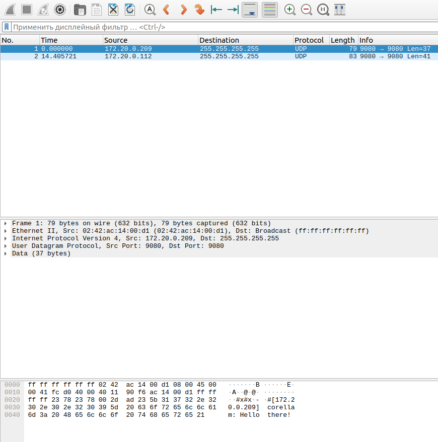

# IPv4 Chat

Простой консольный чат на C++ с использованием сокетов (UDP, IPv4)
Позволяет нескольким пользователям в локальной сети обмениваться сообщениями в реальном времени.

---

## Запуск в тестовой среде (Docker)

Для отладки и проверки предусмотрены скрипты с контейнерами:

```bash
docker build -t ipv4_chat .
```


```bash
bash test/launch_chat1.sh
bash test/launch_chat2.sh
```
После запуска создаётся отдельная подсеть Docker, где два контейнера могут обмениваться сообщениями через broadcast.

Чтобы остановить тестовую среду:

```bash
bash test/stop.sh
```

Чтобы удалить выделенную подсеть:
```bash
docker network rm net
```

---

## Локальный запуск
Соберите проект командой:

```bash
make
```
После сборки появится исполняемый файл `ipv4_chat`

Пример запуска:
```bash
./ipv4_chat <ip> <port>
```
где:
- `<ip>` - адрес (например 192.168.0.3)
- `<port>` - номер порта (например 9080)

---

## Перехват пакетов (PCAP)
Можно открыть файл `results.pcap` при помощи Wireshark, чтобы увидеть что UDP-пакеты отправляются на broadcast

---

## Ограничения

- Работает только по IPv4

- Используется UDP, доставка пакетов не гарантируется

- Нет шифрования сообщений

---

## Документация 
Проект сопровождается документацией, сгенерированной при помощи Doxygen.
Чтобы открыть её, перейдите в:
```bash
docs/html/index.html
```